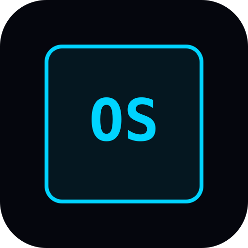

<div align="center">



**SYSTEM / SESSION TOOL / CARLRPG**

# CRAWLER OS

*La Tierra ya no es un planeta. Es un dungeon televisado. The System lleva la cuenta, reparte el loot y cobra las multas. Tú eres un crawler: una hoja holográfica, un inventario y una audiencia que espera verte morir con estilo. Esto es el visor que te inyectaron al cruzar el primer piso.*

[](#roles)
[](#roles)
[](#roles)

El Dungeon Master dirige la mesa. Los crawlers viven el HUD. La TV muestra el dungeon.

</div>

---

## Roles

| | Ruta | Qué ve |
|---|---|---|
| **Dungeon Master** | `/dm` | Control total. Recursos, crawlers, dados, loot, penalizaciones. Acento **cian**. |
| **Crawler** | `/crawler` | Su visor. Hoja, inventario, notificaciones, log personal. Acento **magenta**. |
| **Mesa TV** | `/table/[code]` | Vista compartida, sin nav. El dungeon en la tele. |

El crawler no ve controles de Dungeon Master. Ni deshabilitados.

## Stack

Next.js 15 · TypeScript · Tailwind · **Supabase** (Auth, Postgres, Realtime) · **Vercel**

Void `#05060D` · Sistema `#00D4FF` · Crawler `#E879F9` · Loot `#F97316` · Penalty `#FF3B5C`

## Jack In (local)

Guía paso a paso (si no programas a diario): **[docs/guia-local.md](docs/guia-local.md)**.

Necesitas **Node 20+** y **Docker Desktop** en marcha.

```bash
cd crawler-os
npm install
npm run setup:local   # arranca Supabase, aplica migraciones + seed, escribe .env.local
npm run dev
```

Abre `http://localhost:3000` en **varios navegadores** (o uno en incógnito):

| Cliente | Cuenta | Contraseña | Ruta |
|---|---|---|---|
| Dungeon Master | `dm@crawler.local` | `crawleros` | `/dm` |
| Crawler 1 | `crawler1@crawler.local` | `crawleros` | `/join` → `FLOOR-TEST` |
| Crawler 2 | `crawler2@crawler.local` | `crawleros` | `/join` → `FLOOR-TEST` |
| Mesa TV | (sin login) | — | `/table/FLOOR-TEST` |

En `/login` salen atajos de esas cuentas. Studio: `http://127.0.0.1:54323`.

`.env.example` es la plantilla. `.env.local` no se sube a git.

### Sin Docker (Supabase hosted)

Copia `.env.example` a `.env.local` y pega URL + anon key del dashboard. En SQL Editor ejecuta `supabase/migrations/20260302120000_initial_schema.sql`. Auth → Email: sin confirmación. Site URL `http://localhost:3000`. Luego `npm run dev`.

### Scripts

| Comando | |
|---|---|
| `npm run setup:local` | Docker + Supabase local + `.env.local` |
| `npm run dev` | Next en `localhost:3000` |
| `npm run db:start` / `db:stop` | encender / apagar Supabase |
| `npm run db:reset` | recrear BD y seed |
| `npm run db:types` | tipos TS |

## Deploy

Importar el repo en [Vercel](https://vercel.com). Pegar las env vars. Poner la URL de Vercel en los redirects de Supabase. Redeploy.

## Spec

| | |
|---|---|
| [Design/](Design/) | HUD, tokens, pantallas |
| [Rules/](Rules/) | Contrato para agentes |
| [docs/](docs/) | CarlRPG — local, no en git |

---

<div align="center">

*The System is not angry. The System is disappointed.*  
*And also angry.*

</div>
